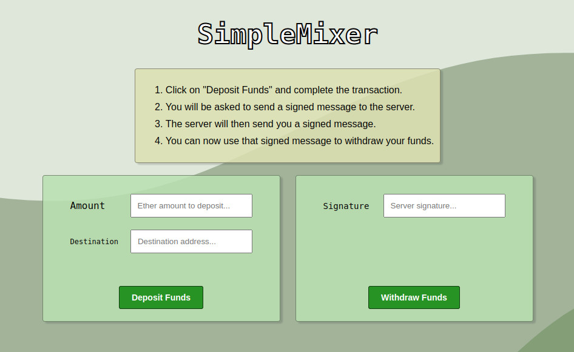

# SimpleMixer



SimpleMixer is a simple centralized Ethereum mixer that uses EIP-712 signatures for withdrawing funds.
Users are able to deposit funds into the contract but they need a signature from the central server in order to retrieve the funds back.

The central server will emit a new EIP712 signed message. 
The user can now use that signature from a different public address to interact with the contract **withdraw** method.
This method will check if the signature was signed by the central address and send the funds (minus a configurable fee).

## Deployment

First step is to have a local node running, usually `ganache` is a good fit.

After the node is running, next step is to deploy the smart contract with the deployment script:

```shell
npx hardhat run --network localhost scripts/deploy-mixer.js
```

And finally, its time to run the web server:

```shell
./simple_mixer -privateKey "0x56....." -contractAddress "0x42....."
```

The web server application expects you to pass some flags (privateKey used for signing and contractAddress).
Its important that the privateKey attribute matches the private key of the contract deployer (used on the contract constructor).


## Repository structure

- hardhat: Directory containing all Solidity related files. Tests, deployment and smart-contracts.
- web: Contains the mixer frontend and backend in Go.

## How it works

The main idea is that any user is able to call the `deposit` method from the contract, 
after that a signature should be provided to the user, he is then able to call `withdraw` to retrieve the funds.

- User A calls `deposit` with any amount of Ether.
- User A generates proof by sending a signed message to the server and some data (destination address for example).
- The server generates an EIP-712 signature and sends it back to the user.
- User A can now call `withdraw`  and the funds will go to the provided destination address.

## Limitations

The main limitation is that its a centralized model, 
the main server is able to view the relation between deposit and withdraw calls.

Due to front-running issues the user A must provide a destination address to the server.
If not, users could check the Mempool and get the signature, using it with a different `to` address.

If the central server dissapears any user without an already generated signature wont be able to retrieve the funds back. 
Unless the private key was shared, so users could generate the needed signatures.
